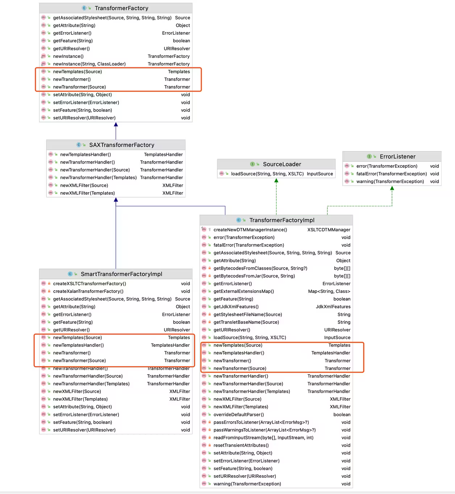

# Abstract Factory Pattern (抽象工廠模式) (Kit Pattern)

> **抽象工廠模式**是一種創建型設計模式，提供一個介面來建立相關或相依的物件家族，而不需要指定具體類別

### 抽象工廠模式結構


### 抽象工廠模式的應用場景

1. **如果程式碼需要與多個不同系列的相關產品溝通，但由於無法提前獲取相關訊息，或者出於對未來擴展性的考慮，你不希望程式碼基於產品的具體類進行建構**
    > 抽象工廠提供了一個介面，可以用於創建每個系列產品的對象。只需要程式碼通過介面創建對象，就不會生成與應用程式已生成的產品類型不一致的產品。
2. **如果你有一個基於一組抽象方法的類，且其主要功能因此變得不明確，那麼在這種情況下可以考慮使用抽象工廠**
    > 在設計良好的程式碼中，每個類**僅負責一件事**。如果一個類與多種類型產品溝通，就可以考慮將工廠方法抽取到**獨立的工廠類**或具備完整功能的**抽象工廠類**中。

### 優缺點

:o:**優點**

1. 可以確保同一工廠生產的產品相互匹配
2. 可以避免客戶端與具體產品程式碼的耦合
3. 單一職責原則。可以將產品生成程式碼抽取到同一個位置，使代碼易於維護
4. 開放封閉原則。向應用程式中引入新產品時，無須修改客戶端程式碼

:x:**缺點**

1. 由於採用模式需要向應用中引入眾多介面和類，程式碼可能會比之前更加複雜

## 抽象工廠模式(Abstract Factory Pattern)

### 原始的模型架構

-   以下的情境是基於工廠模式而來[工廠模式](../Factory%20Method%20Pattern/Factory%20Method%20Pattern.md)

### 遇到的需求與問題

10. Pizza 店的製作流程被統一後，但 Pizza 產品內部的食材卻因地區不同，而且 NYStyleCheesePizza 與 ChicagoStyleCheesePizza 只差在地區性食材的地方，Pizza 的作法是相同的(餅皮+醬料+起司)，都有相同的準備步驟，只是使用不同的食材。

```java
public class NYStyleCheesePizza extends Pizza {

    public NYStyleCheesePizza() {
        name = "NY Style Sauce and Cheese Pizza";
        dough = "Thin Crust Dough"; // 餅皮(只差在地區性食材不同)
        sauce = "Marinara Sauce"; // 醬料(只差在地區性食材不同)

        toppings.add("Grated Reggiano Cheese"); // 起司(只差在地區性食材不同)
    }
}

// ----------------------------------------------------------------

public class ChicagoStyleCheesePizza extends Pizza {

    public ChicagoStyleCheesePizza() {
        name = "Chicago Style Deep Dish Cheese Pizza";
        dough = "Extra Thick Crust Dough"; // 餅皮(只差在地區性食材不同)
        sauce = "Plum Tomato Sauce"; // 醬料(只差在地區性食材不同)

        toppings.add("Shredded Mozzarella Cheese"); // 起司(只差在地區性食材不同)
    }

    void cut() {
        System.out.println("Cutting the pizza into square slices");
    }
}
```

### (抽象工廠)為食材製作工廠

> [!TIP]
>
> **抽象工廠模式**提供一個介面來建立相關或相依的物件家族，而不需要指定具體類別

11. 首先定義介面的抽象工廠，實例**不同地區的食材工廠**來針對**不同地區風味的食材**做製造

```java
public interface PizzaIngredientFactory {

    // 介面裡面，我們為每一種食材定義一個create方法
    // 每一種食材一個類別
    public Dough createDough();
    public Sauce createSauce();
    public Cheese createCheese();
    public Veggies[] createVeggies();
    public Pepperoni createPepperoni();
    public Clams createClam();
}

// ----------------------------------------------------------------

public class NYPizzaIngredientFactory implements PizzaIngredientFactory { // 紐約風味食材工廠實作所有食材工廠的介面

    /* 為每一種食材家族裡的每一種食材建立紐約風味 */
    public Dough createDough() {
        return new ThinCrustDough();
    }

    public Sauce createSauce() {
        return new MarinaraSauce();
    }

    public Cheese createCheese() {
        return new ReggianoCheese();
    }

    // 這裡將蔬菜寫死，我們也可以採取更精巧的作法
    public Veggies[] createVeggies() {
        Veggies veggies[] = { new Garlic(), new Onion(), new Mushroom(), new RedPepper() };
        return veggies;
    }

    // 紐約和芝加哥風味都使用相同的食材
    public Pepperoni createPepperoni() {
        return new SlicedPepperoni();
    }

    // 紐約靠海，所以他有新鮮的。
    public Clams createClam() {
        return new FreshClams();
    }
}
```

12. 修改 Pizza 類(抽象產品)，讓食材工廠生產食材即可，並修改 CheesePizza(具體產品)，讓要求食材由工廠製造

```java
public abstract class Pizza {
	String name;

    /* 每一種Pizza都保存一組食材，在準備時使用 */
	Dough dough;
	Sauce sauce;
	Veggies veggies[];
	Cheese cheese;
	Pepperoni pepperoni;
	Clams clam;

    // 把prepare宣告成抽象的。我們將在這裡收集Pizza
	abstract void prepare();

	void bake() {
		System.out.println("Bake for 25 minutes at 350");
	}

	void cut() {
		System.out.println("Cutting the pizza into diagonal slices");
	}

	void box() {
		System.out.println("Place pizza in official PizzaStore box");
	}

	void setName(String name) {
		this.name = name;
	}

	String getName() {
		return name;
	}
}

// ----------------------------------------------------------------

public class CheesePizza extends Pizza {
	PizzaIngredientFactory ingredientFactory;

	public CheesePizza(PizzaIngredientFactory ingredientFactory) { // 為了製作Pizza，我需要一個工廠來提供食材
		this.ingredientFactory = ingredientFactory; // 會在建構式接收一個工廠，並將它存入一個實例變數
	}

	void prepare() {
		System.out.println("Preparing " + name);
		dough = ingredientFactory.createDough(); // 每次他需要一個食材時，就會要求工廠生產他
 		sauce = ingredientFactory.createSauce();
		cheese = ingredientFactory.createCheese();
	}
}
```

13. 修改 PizzaStore(客戶端)，我們要給他們一地區的食材工廠

```java
public class NYPizzaStore extends PizzaStore {

	protected Pizza createPizza(String item) {
		Pizza pizza = null;
		PizzaIngredientFactory ingredientFactory =
			new NYPizzaIngredientFactory(); // 紐約店與紐約食材工廠搭配。他會使用生產所有紐約風味Pizza的食材

		if (item.equals("cheese")) {

			pizza = new CheesePizza(ingredientFactory); // 將食材工廠傳給各個Pizza
			pizza.setName("New York Style Cheese Pizza");

		} else if (item.equals("veggie")) {

			pizza = new VeggiePizza(ingredientFactory);
			pizza.setName("New York Style Veggie Pizza");

		} else if (item.equals("clam")) {

			pizza = new ClamPizza(ingredientFactory);
			pizza.setName("New York Style Clam Pizza");

		} else if (item.equals("pepperoni")) {

			pizza = new PepperoniPizza(ingredientFactory);
			pizza.setName("New York Style Pepperoni Pizza");

		}
		return pizza;
	}
}
```


> [!NOTE]
>
> 抽象工廠提供一種介面來讓我們建立一個**產品家族**。使用這種介面可以 _程式碼_ 與 _建立產品的實際工廠_ 解偶。這可以讓我們製作各種工廠，為**不同的背景**(例如不同的地區、作業系統、外觀與感覺)生產不同的產品。

## 比較工廠方法和抽象工廠

### 抽象工廠裡的方法都被宣告成抽象的，讓子類別覆寫，來建立某個物件，他們是不是藏在抽象工廠裡的工廠方法？

-   抽象工廠的方法通常被做成工廠方法。抽象工廠的工作是定義一個介面，用他來建立一組產品。在那個介面裡面的每一個方法都負責建立一個具體產品，我們實作抽象工廠的子類別，來提供這些實作。所以若要在抽象工廠裡實作產品方法，使用工廠方法是很自然的作法。

```java
// ----------------------------抽象工廠方法----------------------------

public interface PizzaIngredientFactory { // 宣告成介面，讓子類工廠實作

	/* 產品不只一種，而是產品家族 */
    public Dough createDough();
    public Sauce createSauce();
    public Cheese createCheese();
    public Veggies[] createVeggies();
    public Pepperoni createPepperoni();
    public Clams createClam();
}

// -----------------------------------------------------------------

public class NYPizzaIngredientFactory implements PizzaIngredientFactory { // 實作工廠介面

	/* 會有多個物件，每個物件都是一個分類的產品，透過他們組合再一起*/
    public Dough createDough() {
        return new ThinCrustDough(); // 提供實作實例
    }

    public Sauce createSauce() {
        return new MarinaraSauce();
    }

    public Cheese createCheese() {
        return new ReggianoCheese();
    }

	...
}

// ----------------------------工廠方法--------------------------------

public abstract class PizzaStore { // 宣告成抽象類別，讓子類實作工廠方法

    public Pizza orderPizza(String type) {
		...
    }

	/* 產品只有一個 */
    protected abstract Pizza createPizza(String item); // 宣告成抽象，讓子類實作
}

// -----------------------------------------------------------------

public class NYPizzaStore extends PizzaStore {// 繼承工廠介面

	/* 回傳一個分類的產品 */
    Pizza createPizza(String item) { // 子類決定要實例化哪一個
        if (item.equals("cheese")) {
            return new NYStyleCheesePizza();
        } else if (item.equals("veggie")) {
            return new NYStyleVeggiePizza();
        } else if (item.equals("clam")) {
            return new NYStyleClamPizza();
        } else if (item.equals("pepperoni")) {
            return new NYStylePepperoniPizza();
        } else return null;
    }
}
```

### 差異

|   比較   |           工廠方法模式(Factory Method Pattern)           |                    抽象工廠模式(Abstract Factory Pattern)                    |
| :------: | :------------------------------------------------------: | :--------------------------------------------------------------------------: |
|   關注   |                 單一產品的建立過程(new)                  |                            產品族和產品之間的關係                            |
|   目的   |  建立一系列的產品，且想要確保用戶端製作的產品屬於同一類  | 將用戶端程式碼與需要實例化的具體類別解偶，或是事先不知道需要使用的具體類別時 |
| 創建方法 |                       用類別(繼承)                       |                                 用物件(組合)                                 |
| 實現方法 |      建立物件。其實只讓你用子類別來為你做建立的動作      | 物件組合。提供一個用來建立一系列產品的抽象型態，讓子類別負責定義產品怎麼產生 |
|   用法   | 用戶端只需要知道所使用的抽象型態，具體型態交給子類別處理 |              要先實例化一個，在將他傳入針對抽象型態撰寫的程式碼              |
|   擴展   |              只需要繼承工廠方法，並實作即可              |            需要修改介面，必須修改每一個子類別的介面，是繁重的工作            |
| 物件特色 |     抽象工廠裡只有一個工廠方法，只創建一個分類的產品     |               抽象工廠裡定義很多工廠方法，每個工廠方法創建一個               |


## 退化例子

### 完整抽象工廠模式


### 如果抽象工廠裡定義的創建方法只有一個(只有一個分類的產品)，抽象工廠退化成工廠方法

* 上圖的Dough改成Pizza，就是工廠方法在說的東西

### 如果只有一個具體工廠，退化成簡單工廠模式

* 因為每個配料只有一個實作，所以沒有使用interface的必要，把上圖的各種配料改成各個Pizza，就是簡單工廠模式

## 抽象工廠在JDK中的例子

### TransformerFactory



* **抽象工廠**：TransformerFactory,SAXTransformerFactory
* **工廠方法**：newTransformer(), newTemplates()
* **具體工廠**：SmartTransformerFactoryImpl, TransformerFactoryImpl
* **抽象產品**：Transformer、Templates
* **具體產品**：Transformer實現類、Templates實現類