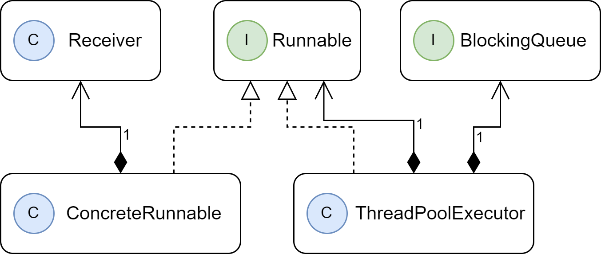

# Command Pattern (命令模式) (Action) (Transaction)

> **命令模式**是一種行為設計模式，可將請求封裝成物件，讓你可以將請求、佇列或紀錄等物件參數化，並支援可復原的的操作

### 命令模式結構


### 命令模式的應用場景

1. **如果需要把動作變成參數化對象**
    > 命令模式可將特定的方法轉化成獨立對象。你可以將命令作為方法的參數進行傳遞，將命令保存在其他對象中，或是在執行期切換已連接的命令。
2. **如果想要將動作放入隊列中、動作的執行或遠程執行動作**
    > 同其他對象一樣，命令也可以實現序列化，從而方便的寫入文件或數據庫中。一段時間後，再將他恢復成最初的命令對象。因此，可以延遲或計劃命令的執行。也可以將命令放入隊列、紀錄命令、通過網路傳送命令。
3. **如果你想要實現操作回滾功能**
    > 盡管有很多方法可以實現撤銷和恢復功能，但命令模式是其中常用的一種。
    > 為了能夠回滾操作，你需要實現已執行操作的歷史紀錄功能。對所有已執行命令對象及其相關程序狀態備份的 stack 結構，但是這種方法有兩個缺點。
    >
    > 1. 程式狀態的保存功能並不容易實現，因為部分狀態為私有。可以使用**備忘錄模式**來在一定程度上解決這個問題。
    >
    > 2. 備份狀態可能會占用大量內存。有時需要借助另一種實現方式：反向操作。反向操作也有代價：他可能會很難甚至無法實現。

### 使用時機

1. 想*參數化*請求『欲執行的任務』時
2. 依不同*時間*或*佇列*執行命令時
3. 發送*訊息者*與*接收執行者*的生命週期不同時
4. 讓執行的任務具有*復原*或*日誌*功能時
5. 實作*交易(Transaction)功能*時

### 優缺點

:o:**優點**

1. 單一職責原則。可以解藕觸發和執行操作的類。
2. 開放封閉原則。可以在不修改已有客戶端程式碼的情況下，在程式碼中創建先的命令。
3. 可以實現撤銷和恢復功能(Undoable Operations)
4. 可以實現操作的延遲執行(Temporal Decoupling)
5. 可以將一組簡單命令組合成一個複雜命令

:x:**缺點**

1. 程式碼會變得更加複雜，因為你在發送者和接收者之間增加了一個全新的層次。

## 命令模式(Command Pattern)

command 物件藉著將準備送給 receiver 的一組行動綁在一起，來**封裝**請求。command 物件將動作和 receiver 都包在它裡面，只公開一個方法 excute()。當你呼叫 execute()時，就會呼叫 receiver 的動作。在外面，其他的物件都不知道哪個 receiver 執行什麼動作，他們只知道呼叫 execute()方法之後，他們的請求就會被處理。

> [!TIP]
>
> **命令模式**可將請求封裝成物件，讓你可以將請求、佇列或紀錄等物件參數化，並支援可復原的的操作。
>
> 將『**引發命令的物件**』與『**實際執行操作的物件**』隔離開來

### 遇到的需求

-   我們想要設計一個控制器，上面可以登入很多設備，另外有 ON 和 OFF 的按鈕來控制設備，以及最後一個 UNDO 可以復原的按鈕


### 遇到的問題

-   廠商的類別有非常多，而且有著很不一樣的介面，因此希望遙控器不需要知道太多家電的介面細節，也不想在遙控器裡面有一堆家電的 if，(如： if slot1 == Light, then light.on())


### 命令物件

-   命令物件可以用特定的物件(例如客廳電燈物件)來封裝做某件事情的請求(例如打開電燈)
-   我們幫遙控器的按鈕指定一個命令物件，按下按鈕時，只需要呼叫命令物件做某項工作即可

1. 實作 Command 介面，所有的 Command 物件都實作同一個介面，介面有一個通用方法(execute)

```java
public interface Command {
    public void execute(); // 只需要一個execute方法
}
```

2. 實作一個 Command 來開燈。(或是說將廠商的物件封裝在 Command 介面中)

```java
public class LightOnCommand implements Command { // 我們要實作Command介面
    Light light; // 家電的物件

    public LightOnCommand(Light light) { // 讓建構式接收這個command要控制的電燈，假設是客廳電燈，並將它存入變數中。當execute被呼叫的時候，接收請求的就是這個物件。
        this.light = light;
    }

    public void execute() { // execute()方法呼叫物件的on()方法
        light.on();
    }
}
```

3. 建立 Invoker，使用 command 物件。假設我們的遙控器只有一個按鈕及其對應的位置

```java
// This is the invoker
public class SimpleRemoteControl {
    Command slot;

    public SimpleRemoteControl() {}

    public void setCommand(Command command) {
        slot = command;
    }

    public void buttonWasPressed() {
        slot.execute();
    }
}
```

4. 建立簡單的測試程式來使用遙控器

```java
public class RemoteControlTest { // 這是命令模式中的client
    public static void main(String[] args) {
        SimpleRemoteControl remote = new SimpleRemoteControl(); // 遙控器是一個invoker，它會收到一個command物件，那個command物件可以用來發出請求
        Light light = new Light(); // 建立Light物件，它是接受請求的Receiver
        LightOnCommand lightOn = new LightOnCommand(light); // 在這裡建立一個command，並將Receiver傳給他

        remote.setCommand(lightOn); // 將commnad傳給Invoker
        remote.buttonWasPressed(); // 模擬按鈕被按下
    }
}
```

### 完整的遙控器製作

1. 再遙控器中有七個位置，每一個位置都有開、關按鈕，可以將 command 指派給遙控器

```java
onCommands[0] = onCommand;
offCommands[0] = offCommand;
```

2. 當我們建立將被載入遙控器的 Command 時，我們會建立*一個客廳電燈物件的 LightCommand*，另外建立*一個廚房電燈物件的 LightCommand*。因此**請求的 receiver 與封裝它的 command 是綁定的**。所以，當按鈕被按下時，**沒有人在乎電燈是哪一個**，當 execute()方法被呼叫時，對的事情就會發生。

```java
Light light = new Light("Living Room"); // 客廳電燈的物件
LightOnCommand lightOn = new LightOnCommand(light); // 客廳電燈的命令
Light light = new Light("Kitchen"); // 廚房電燈的物件
LightOnCommand lightOn = new LightOnCommand(light); // 廚房電燈的命令
```

3. 將 Command 指派給位置


```java
// This is the invoker
public class RemoteControl { // 這一次控制器會處理7個On和Off command，我們將用相應的陣列來保存他們
    Command[] onCommands;
    Command[] offCommands;

    public RemoteControl() { // 建構式裡，我們只需要實例化與初始化On 和 Off 陣列即可。
        onCommands = new Command[7];
        offCommands = new Command[7];

        Command noCommand = new NoCommand();
        for (int i = 0; i < 7; i++) {
            onCommands[i] = noCommand;
            offCommands[i] = noCommand;
        }
    }

    public void setCommand(int slot, Command onCommand, Command offCommand) { // 接收位置，以及要存入那個位置的 On 和 Off command
        onCommands[slot] = onCommand; // 將這些command放入On與Off陣列，以備後用
        offCommands[slot] = offCommand;
    }

    public void onButtonWasPushed(int slot) { // 當On 或 Off 按鈕被按下時，由硬體負責呼叫對應的方法
        onCommands[slot].execute();
    }

    public void offButtonWasPushed(int slot) {
        offCommands[slot].execute();
    }

    public String toString() { // 列印出每一個位置及其command，測試時使用到它
        StringBuffer stringBuff = new StringBuffer();
        stringBuff.append("\n------ Remote Control -------\n");
        for (int i = 0; i < onCommands.length; i++) {
            stringBuff.append("[slot " + i + "] " + onCommands[i].getClass().getName()
                + "    " + offCommands[i].getClass().getName() + "\n");
        }
        return stringBuff.toString();
    }
}
```

4. 實作 Command，使用上面寫好的 LightOnCommand，以及為 Stereo 編寫 On command

```java
// Light on command
public class LightOnCommand implements Command {
    Light light;

    public LightOnCommand(Light light) {
        this.light = light;
    }

    public void execute() {
        light.on();
    }
}

// stereo On with CD command
public class StereoOnWithCDCommand implements Command {
    Stereo stereo;

    public StereoOnWithCDCommand(Stereo stereo) {
        this.stereo = stereo; /// 我們接收要控制的stereo實例，並將它存入實例變數
    }

    public void execute() {
        stereo.on(); // 將它打開
        stereo.setCD(); // 設定播放CD
        stereo.setVolume(11); // 將音量設成11
    }
}
```

5. 逐步測試遙控器

```java
public class RemoteLoader {

    public static void main(String[] args) {
        RemoteControl remoteControl = new RemoteControl();

        // 在合適的位置建立所有的設備
        Light livingRoomLight = new Light("Living Room");
        Light kitchenLight = new Light("Kitchen");
        CeilingFan ceilingFan= new CeilingFan("Living Room");
        GarageDoor garageDoor = new GarageDoor("Garage");
        Stereo stereo = new Stereo("Living Room");

        // 建立所有的Light Command
        LightOnCommand livingRoomLightOn =
                new LightOnCommand(livingRoomLight);
        LightOffCommand livingRoomLightOff =
                new LightOffCommand(livingRoomLight);
        LightOnCommand kitchenLightOn =
                new LightOnCommand(kitchenLight);
        LightOffCommand kitchenLightOff =
                new LightOffCommand(kitchenLight);

        // 建立吊扇的On與Off Command
        CeilingFanOnCommand ceilingFanOn =
                new CeilingFanOnCommand(ceilingFan);
        CeilingFanOffCommand ceilingFanOff =
                new CeilingFanOffCommand(ceilingFan);

        // 建立車庫的Up與Down Command
        GarageDoorUpCommand garageDoorUp =
                new GarageDoorUpCommand(garageDoor);
        GarageDoorDownCommand garageDoorDown =
                new GarageDoorDownCommand(garageDoor);

        // 建立音響的On與Off Command
        StereoOnWithCDCommand stereoOnWithCD =
                new StereoOnWithCDCommand(stereo);
        StereoOffCommand  stereoOff =
                new StereoOffCommand(stereo);

        // 完成所有command之後，將他們載入遙控器的位置
        remoteControl.setCommand(0, livingRoomLightOn, livingRoomLightOff);
        remoteControl.setCommand(1, kitchenLightOn, kitchenLightOff);
        remoteControl.setCommand(2, ceilingFanOn, ceilingFanOff);
        remoteControl.setCommand(3, stereoOnWithCD, stereoOff);

        // 利用toString()方法，印出每一個遙控器位置，以及指派給它的command
        System.out.println(remoteControl);

        // 逐步按下每一個位置的on和off
        remoteControl.onButtonWasPushed(0);
        remoteControl.offButtonWasPushed(0);
        remoteControl.onButtonWasPushed(1);
        remoteControl.offButtonWasPushed(1);
        remoteControl.onButtonWasPushed(2);
        remoteControl.offButtonWasPushed(2);
        remoteControl.onButtonWasPushed(3);
        remoteControl.offButtonWasPushed(3);
    }
}
```

6. 建立 NoCommand 以取代 if 判斷

-   為了避免每次引用位置都要檢查它有沒有載入 command

```java
public void onButtonWasPushed(int slot) {
    if (onCommands[slot] != null) { // 看起來很醜
        onCommands[slot].execute();
    }
}
```

-   創建一個不做任何事情的 command

```java
public class NoCommand implements Command {
    public void execute() { }
}

```

-   在上面例子中 RemoteControl 的建構式中，將 NoCommand 預先指派給每一個位置，每一個位置就一定有一個 command 可以呼叫

```java
Command noCommand = new NoCommand();
for (int i = 0; i < 7; i++) {
    onCommands[i] = noCommand;
    offCommands[i] = noCommand;
}
```

> [!NOTE]
>
> NoCommand 是一個**null 物件**。null 物件很適合在你無法回傳有意義的物件，而且不想讓用戶端處理**沒有東西可用的(null)的情況**時使用。
>
> 你會發現很多設計模式都有 Null 物件，甚至有人將「Null Object」視為一種設計模式

### 文件撰寫


### 使用 lambda 優化

```java
// 原始的寫法
public class RemoteLoader {

    public static void main(String[] args) {
        RemoteControl remoteControl = new RemoteControl();

        Light livingRoomLight = new Light("Living Room");

        LightOnCommand livingRoomLightOn =
                new LightOnCommand(livingRoomLight); // 可以移除具體的Command物件
        LightOffCommand livingRoomLightOff =
                new LightOffCommand(livingRoomLight);

        remoteControl.setCommand(0, livingRoomLightOn, livingRoomLightOff);
    }
}

// 使用lambda寫法
public class RemoteLoader {

    public static void main(String[] args) {
        RemoteControl remoteControl = new RemoteControl();

        Light livingRoomLight = new Light("Living Room");

        remoteControl.setCommand(0, () -> livingRoomLight.on(),
                                    () -> livingRoomLight.off()); // 我們將具體command寫成lambda運算式
    }
}
```

> [!NOTE]
>
> 這種做法只能在 Command 介面只有**一個**抽象方法時使用，一旦加在第二個抽象方法，lambda 簡寫就無法使用

## 復原按鈕

### 電燈開關恢復

-   假設客廳的電燈是關閉的，當按下 on 之後，電燈會開啟。當你按下復原的時候，理論上電燈會關閉。

1. 讓 Command 介面可以支援復原，因此建立一個 execute()方法對應的 undo()方法

```java
public interface Command {
    public void execute();
    public void undo(); // 建立一個新的undo方法
}
```

2. 我們先處理簡單的 LightOnCommand，如果 On 就是上一次被呼叫的方法，我們知道 undo 必須呼叫 Off 方法，LightOffCommand 同理

```java
public class LightOnCommand implements Command {
    Light light;
    public LightOnCommand(Light light) {
        this.light = light;
    }

    public void execute() {
        light.on();
    }

    public void undo() { // execute 會將電燈開起，所以undo只要將電燈關閉即可
        light.off();
    }
}

public class LightOffCommand implements Command {
    Light light;
    public LightOffCommand(Light light) {
        this.light = light;
    }

    public void execute() {
        light.off();
    }

    public void undo() { // 同理undo將電燈開起
        light.on();
    }
}
```

3. 我們必須讓遙控器追蹤上一次被按下的按鈕以及 undo 按鈕。在 Remote Control 類別中，加入一個新的實例變數來記錄上一個呼叫的 command，當 undo 按下時，讀取那個 command，並呼叫它的 undo()方法

```java
public class RemoteControlWithUndo {
    Command[] onCommands;
    Command[] offCommands;
    Command undoCommand; // 將上一次執行的command存在這裡，讓undo按鈕使用

    public RemoteControlWithUndo() {
        onCommands = new Command[7];
        offCommands = new Command[7];

        Command noCommand = new NoCommand();
        for(int i=0;i<7;i++) {
            onCommands[i] = noCommand;
            offCommands[i] = noCommand;
        }
        undoCommand = noCommand; // undo與其他的位置一樣，在一開始被設定為NoCommand，所以在按下任何其他按鈕之前，按下undo不會做任何事情
    }

    public void setCommand(int slot, Command onCommand, Command offCommand) {
        onCommands[slot] = onCommand;
        offCommands[slot] = offCommand;
    }

    public void onButtonWasPushed(int slot) {
        onCommands[slot].execute();
        undoCommand = onCommands[slot]; // 將他的參考存入undoCommand之中
    }

    public void offButtonWasPushed(int slot) {
        offCommands[slot].execute();
        undoCommand = offCommands[slot]; // 將他的參考存入undoCommand之中
    }

    public void undoButtonWasPushed() { // 當undo按鈕被按下時，我們呼叫undoCommand所儲存的command的undo方法()，它會恢復上一次執行的command動作。
        undoCommand.undo();
    }

    public String toString() {
        StringBuffer stringBuff = new StringBuffer();
        stringBuff.append("\n------ Remote Control -------\n");
        for (int i = 0; i < onCommands.length; i++) {
            stringBuff.append("[slot " + i + "] " + onCommands[i].getClass().getName()
                + "    " + offCommands[i].getClass().getName() + "\n");
        }
        stringBuff.append("[undo] " + undoCommand.getClass().getName() + "\n"); // 加入undo的測試
        return stringBuff.toString();
    }
}
```

4. 測試電燈恢復

```java
public class RemoteLoader {

    public static void main(String[] args) {
        RemoteControlWithUndo remoteControl = new RemoteControlWithUndo();

        Light livingRoomLight = new Light("Living Room");

        LightOnCommand livingRoomLightOn =
                new LightOnCommand(livingRoomLight);
        LightOffCommand livingRoomLightOff =
                new LightOffCommand(livingRoomLight);

        remoteControl.setCommand(0, livingRoomLightOn, livingRoomLightOff);

        remoteControl.onButtonWasPushed(0); // Light is on
        remoteControl.offButtonWasPushed(0); // Light is off
        System.out.println(remoteControl); // [undo] LightOffCommand
        remoteControl.undoButtonWasPushed(); // Light is on
        remoteControl.offButtonWasPushed(0); // Light is off
        remoteControl.onButtonWasPushed(0); // Light is on
        System.out.println(remoteControl); // [undo] LightOnCommand
        remoteControl.undoButtonWasPushed(); // Light is off
    }
}
```

### 使用狀態來實作恢復

-   例如 CeilingFan 可以設定一些速度，也有 OFF 方法

1. 查看 CeilingFan 的原始碼

```java
public class CeilingFan {
    public static final int HIGH = 3;
    public static final int MEDIUM = 2;
    public static final int LOW = 1;
    public static final int OFF = 0;
    String location;
    int speed; // 類別保存一些區域狀態，代表吊扇的速度

    public CeilingFan(String location) {
        this.location = location;
        speed = OFF;
    }

    // 用這些方法設定吊扇的速度
    public void high() {
        speed = HIGH;
        System.out.println(location + " ceiling fan is on high");
    }

    public void medium() {
        speed = MEDIUM;
        System.out.println(location + " ceiling fan is on medium");
    }

    public void low() {
        speed = LOW;
        System.out.println(location + " ceiling fan is on low");
    }

    public void off() {
        speed = OFF;
        System.out.println(location + " ceiling fan is off");
    }

    // 可以使用這個方法取得目前吊扇的速度
    public int getSpeed() {
        return speed;
    }
}
```

2. 為吊扇的 command 加入恢復功能

```java
public class CeilingFanHighCommand implements Command { // High、Medium、Low、Off各需要一個command物件
    CeilingFan ceilingFan;
    int prevSpeed; // 加入區域變數來記錄吊扇上一次的速度

    public CeilingFanHighCommand(CeilingFan ceilingFan) {
        this.ceilingFan = ceilingFan;
    }

    public void execute() {
        prevSpeed = ceilingFan.getSpeed(); // 再更改吊扇速度前，先記錄他之前的狀態，在恢復的時候使用
        ceilingFan.high();
    }

    public void undo() { // 在恢復時，將吊扇的速度設回去他之前的速度
        if (prevSpeed == CeilingFan.HIGH) {
            ceilingFan.high();
        } else if (prevSpeed == CeilingFan.MEDIUM) {
            ceilingFan.medium();
        } else if (prevSpeed == CeilingFan.LOW) {
            ceilingFan.low();
        } else if (prevSpeed == CeilingFan.OFF) {
            ceilingFan.off();
        }
    }
}
```

3. 測試吊扇

```java

package headfirst.designpatterns.command.undo;

public class RemoteLoader {

    public static void main(String[] args) {
        RemoteControlWithUndo remoteControl = new RemoteControlWithUndo();

        CeilingFan ceilingFan = new CeilingFan("Living Room");

        // 這裡實例化三個command
        CeilingFanMediumCommand ceilingFanMedium =
                new CeilingFanMediumCommand(ceilingFan);
        CeilingFanHighCommand ceilingFanHigh =
                new CeilingFanHighCommand(ceilingFan);
        CeilingFanOffCommand ceilingFanOff =
                new CeilingFanOffCommand(ceilingFan);

        // 將medium放入第0個位置，將high放入第1個位置，並且也載入off command
        remoteControl.setCommand(0, ceilingFanMedium, ceilingFanOff);
        remoteControl.setCommand(1, ceilingFanHigh, ceilingFanOff);

        remoteControl.onButtonWasPushed(0); // Living Room ceiling fan is on medium
        remoteControl.offButtonWasPushed(0); // Living Room ceiling fan is off
        System.out.println(remoteControl); // [undo] CeilingFanOffCommand
        remoteControl.undoButtonWasPushed(); // Living Room ceiling fan is on medium

        remoteControl.onButtonWasPushed(1); // Living Room ceiling fan is on high
        System.out.println(remoteControl); // [undo] CeilingFanHighCommand
        remoteControl.undoButtonWasPushed(); // Living Room ceiling fan is on medium
    }
}
```

### 歷史紀錄的方法

1. 直接儲存(Reference)
2. Clone 一個新的命令在儲存

第二個是因為：你無法確保執行命令後，**該命令物件不會產生變化，或重複呼叫**，複製一份可以確保其乾淨狀態(Clean State)，這也是 Prototype 模式的應用

> [!NOTE]
>
> 命令模式實務上也經常使用 **抽象類別**，來實現模板方法(Template method)，或儲存 Receiver 狀態等共用功能

1. 使用擴展方法 undo()的方式，為了實現**公共功能(Cloneable)**將 Command 介面改成**抽象類別**

```java
public abstract class Command implements Cloneable{
    public abstract void execute();
    public abstract void undo();

    @Override
    public Object clone() throws CloneNotSupportedException {
        return super.clone();
    }
}
```

2. Receiver 不用更改，Invoker 使用 Stack 的方式儲存，儲存的為 Clone 後的命令，而非 Reference

```java
public class InvokerWithHistory {
    private Queue<Command> commands = new LinkedList<>(); // 巨集佇列命令

    private Stack<Command> history = new Stack<>(); // stack 歷史紀錄

    public InvokerWithHistory() {
    }

    public void addCommand(Command command) {
        commands.offer(command);
    }

    public void cancelCommand(Command command) {
        commands.remove(command);
    }

    public void undo() {
        if (!history.isEmpty()) {
            Command command = history.pop();
            command.undo();
        } else {
            System.out.println("[復原失敗] --- 查無紀錄");
        }
    }

    public void do() {
        while (!commands.isEmpty()) {
            Command command = commands.poll();
            command.execute();

            addHistoryByClone(command); // 執行過後，用Clone的方式儲存Command
        }
    }

    private void addHistoryByClone(Command command) {
        Command commandClone = null;
        try {
            commandClone = (Command) command.clone();
        } catch (CloneNotSupportedException e) {
            e.printStackTrace();
        }
        history.push(commandClone);
    }

    private void addHistoryByReference(Command command) {
        history.push(command);
    }
}
```

## 使用巨集 Command(派對模式)

### 需求

-   希望遙控器可以用一顆按鈕同時調暗燈光、打開音響和電視、讓熱水浴缸開始加溫

### 創建巨集的 Command

1. 製作一種新的 Command，讓他可以執行其他多個 Command

```java
public class MacroCommand implements Command {
    Command[] commands;

    public MacroCommand(Command[] commands) { // 接收一個Command陣列，並存入MacroCommand
        this.commands = commands;
    }

    public void execute() {
        for (int i = 0; i < commands.length; i++) { // 當遙控器執行巨集時，一次執行這些command
            commands[i].execute();
        }
    }

    /**
     * NOTE:  these commands have to be done backwards to ensure
     * proper undo functionality
     */
    public void undo() {
        for (int i = commands.length -1; i >= 0; i--) {
            commands[i].undo();
        }
    }
}
```

2. 使用巨集 Command

```java
public class RemoteLoader {

    public static void main(String[] args) {

        RemoteControl remoteControl = new RemoteControl();

        // 建立所有的設備：電燈、電視、音響、熱水浴缸
        Light light = new Light("Living Room");
        TV tv = new TV("Living Room");
        Stereo stereo = new Stereo("Living Room");
        Hottub hottub = new Hottub();

        // 建立所有的ON、OFF Command來控制他們
        LightOnCommand lightOn = new LightOnCommand(light);
        StereoOnCommand stereoOn = new StereoOnCommand(stereo);
        TVOnCommand tvOn = new TVOnCommand(tv);
        HottubOnCommand hottubOn = new HottubOnCommand(hottub);
        LightOffCommand lightOff = new LightOffCommand(light);
        StereoOffCommand stereoOff = new StereoOffCommand(stereo);
        TVOffCommand tvOff = new TVOffCommand(tv);
        HottubOffCommand hottubOff = new HottubOffCommand(hottub);

        // 建立On Command的陣列、Off Command的陣列
        Command[] partyOn = { lightOn, stereoOn, tvOn, hottubOn};
        Command[] partyOff = { lightOff, stereoOff, tvOff, hottubOff};

        // 並建立兩個對應的巨集來保存他們
        MacroCommand partyOnMacro = new MacroCommand(partyOn);
        MacroCommand partyOffMacro = new MacroCommand(partyOff);

        // 將巨集command指派給按鈕，和處理任何command一樣
        remoteControl.setCommand(0, partyOnMacro, partyOffMacro);

        System.out.println(remoteControl);
        System.out.println("--- Pushing Macro On---");
        remoteControl.onButtonWasPushed(0);
        /*
            Light is on
            Living Room stereo is on
            Living Room TV is on
            Living Room TV channel is set for DVD
            Hottub is heating to a steaming 104 degrees
            Hottub is bubbling!
        */
        System.out.println("--- Pushing Macro Off---");
        remoteControl.offButtonWasPushed(0);
        /*
            Light is off
            Living Room stereo is off
            Living Room TV is off
            Hottub is cooling to 98 degrees
        */
    }
}
```

## 沒有蠢問題

**Q: 一定要使用 receiver 嗎？為何不讓 command 物件實作 execute()方法的細節？**

A: 通常我們會盡量設計只知道如何呼叫 receiver 的「笨」command 物件。但是你也會看到很多「聰明的」command 物件，它們實作了執行請求所需的大部分(甚至到全部的)邏輯。不過如此一來，invoker 和 receiver 之間的解偶合程度就沒有那麼好了，也無法將 receiver 當成參數傳給 command

**Q: 怎麼做出復原操作的歷史紀錄？我想要讓 undo 按鈕可以按下很多次**

A: 可以用一個 stack 來保存執行過的所有 command，當 undo 被按下時，讓 invoker 從堆疊 pop 出一個 command，並呼叫它的 undo()方法

**Q: 我可以將派對模式寫成 Command 嗎？建立一個 PartyCommand，並將執行其他 Command 的呼叫都放在 PartyCommand 的 execute()方法裡面**

A: 可以，但這樣就將派對模式「寫死」在 PartyCommand 裡面了，如果使用 MacroCommand，可以動態決定哪些 Command，會更加靈活。

## 命令模式的其他用途: 將請求佇列化(ThreadPoolExecutor)

Command 可以讓我們將一個運算(一個 receiver 和一組動作)包裝起來，讓你將它當成一級(first-class)物件到處傳遞。那些計算可能在 client 應用程式建立 command 物件很久之後才被呼叫，甚至可以被不同的執行緒呼叫，利用這種特性來實作例如排程器、執行緒池、工作佇列。

1. 抽象命令 Command: Runnable 介面
2. 具體命令 ConcreteCommand: 由使用者自己創建這個類，實現 Runnable 介面，重寫 run 方法，在 run 方法中寫具體業務邏輯。(可能會持有 Receiver)
3. 發送者 Invoker: ThreadPoolExecutor，他持有一個命令隊列，使用者可以向他提交要執行的命令
4. 接收者 Receiver: 常常與 Runnable 實例中 run 方法重疊，不一定會有
5. 命令隊列：BlockingQueue，任務阻塞隊列，實際上就是模式中的命令隊列



```java
public interface Runnable {
    public abstract void run();
}
```

```java
public class ConcreteCommand implements Runnable {
    @Override
    public void run() {
        System.out.println(Thread.currentThread().getName() + " is running")
    }
}
```

```java
public class ThreadPoolExecutor {
    private final BlockingQueue<Runnable> workQueue; // 命令隊列
    public void execute(Runnable runnable) {/*與命令模式無關*/} // 加入命令隊列
    final void runWorker(Worker w) {/*與命令模式無關*/} // 執行命令隊列中所有命令
}
```

```java
public class ThreadPoolExecutorTest {
    public static void main(String[] args) {
        ThreadPoolExecutor pool = new ThreadPoolExecutor(5,
                Runtime.getRuntime().availableProcessors() * 2,
                60,
                TimeUnit.SECONDS,
                new ArrayBlockQueue<>(200),
                new ThreadFactory() {
                    @Override
                    public Thread newThread(Runnable r) {
                        Thread t = new Thread(r);
                        t.setName("order-thread");
                        return t;
                    }
                }, new ThreadPoolExecutor.AbortPolicy());

        Runnable concreteCommand = new ConcreteCommand();

        pool.execute(concreteCommand);

        pool.shutdown();
    }
}
```

## 命令模式的其他用途: 記錄請求

> [!NOTE]
>
> 命令的儲存與載入(Store and Load)

有些應用程式的語意(semantic)要求我們記錄所有的動作，並且在當機時，藉著重新呼叫那些動作來復原，命令模式可以讓我們藉著加入**store()與 load()方法**來支援這種語意。在 Java 裡，雖然我們可以用物件序列化來實作這些方法，但是序列化來進行持久保存時需要注意的事情依然存在。 (Java 序列化就是備忘錄模式(Momento)的一種實作)

在執行 command 時，我們將他們的歷史紀錄存入磁碟，當機時，我們重新載入 command 物件，並依序呼叫他們的 execute()。

藉著日記(Logging)，我們可以將上一個檢查點之後的所有動作存起來，在系統故障的時候，將動作應用在那個檢查點上面。擴展這些技術，用**交易(Transactional)**機制來執行好幾組動作。

-   儲存的時機：

    -   新增完命令式
    -   執行完命令式
    -   復原執行過的命令後

-   載入的時機：

    -   系統初始化時(檢查是否有未執行命令)
    -   發生異常時

> [!WARNING]
>
> Store 和 Load 的做法比較少見，因為命令還要負責儲存載入，有點**踰越職責**了

### 比較常見的做法是，使用一個新的介面

定義兩個基本操作：

1. writeFile(Store)
2. readFile(Load)

```java
public interface Logger {
    void writeFile(String pathName, Object object);
    Object readFile(String pathName);
}
```

呼叫者 Invoker 在上面儲存和載入的時機點上，呼叫具體的 Logger 方法就可以了，當然要替換儲存與載入的方法或演算法，只需要新增一個類別時做 Logger 介面。

Invoker 不用知道具體的 Logger 是誰，只管呼叫方法，這也是**策略模式**的結合應用～！

### 儲存的實現

1. 物件序列化(Serialization)
2. 資料庫

-   以物件序列化舉例

1. 首先我們需要被序列化的物件，時做 Serializable 介面，Command 類別時常使用抽象類別

```java
public abstract class Command implements Cloneable, Serializable{
    public abstract void execute();
    public abstract void undo();

    @Override
    public Object clone() throws CloneNotSupportedException {
        return super.clone();
    }
}
```

2. 撰寫具體的 Logger 類別

```java
public class FileLogger implements Logger {
    public void writeFile(String pathName, Object object) {
        File file = new File(pathName);

        try (FileOutputStream fs = new FileOutputStream(file);
             BufferedOutputStream bs = new BufferedOutputStream(fs);
             ObjectOutputStream os = new ObjectOutputStream(bs)
        ) {

            // if file doesn't exists, then create it

            if (!file.exists()) {
                file.createNewFile();
            }

            os.writeObject(object);

            System.out.println("-----寫入菜單日誌 (Log)-----");

        } catch (IOException e) {
            e.printStackTrace();
        }
    }

    public Object readFile(String pathName) {

        Object result = null;

        File file = new File(pathName);

        if (!file.exists()) {
            return null;
        }

        try (FileInputStream fs = new FileInputStream(file);
             BufferedInputStream bs = new BufferedInputStream(fs);
             ObjectInputStream os = new ObjectInputStream(bs)) {

            result = os.readObject();

            System.out.println("-----讀取菜單日誌 (Log)-----");

        } catch (IOException | ClassNotFoundException e) {
            e.printStackTrace();
        }
        return result;
    }
}
```

## 命令模式的其他用途: 觀察者模式兼命令模式

Java的Swing程式庫有許多**ActionListener**形式的**Observer**可以監聽(或觀察)使用者介面元件的事件。

事實上ActionListener不但是Observer介面，也是Command介面，而且AngelListener、DevilListener類別不僅是Observer，也是具體的Command。

```java
public class SwingCommandExample {
    JFrame frame = new JFrame();
    JPanel panel = new JPanel();

    public static void main(String[] args) {
        SwingCommandExample example = new SwingCommandExample();
        example.go();
    }

    public void go() {
        // The GUI is the client
        // The buttons are the invokers
        JButton onButton = new JButton("On");
        JButton offButton = new JButton("Off");

        // The light is the receiver
        JLabel light = new JLabel("light");
        light.setOpaque(true);
        light.setBackground(Color.LIGHT_GRAY);

        // The lambdas (ActionListeners) are the commands
        // The interface that all the commands (listeners) implement is the ActionListener interface.
        // This interface has one method, actionPerformed(). This is equivalent to the execute() method.
        // This method which executes the code to run on the receiver, the light.
        onButton.addActionListener(event ->
            light.setBackground(Color.YELLOW)
        );
        offButton.addActionListener(event ->
            light.setBackground(Color.LIGHT_GRAY)
        );

        // Set frame properties
        frame.setContentPane(panel);
        panel.add(onButton);
        panel.add(light);
        panel.add(offButton);

        frame.setDefaultCloseOperation(JFrame.EXIT_ON_CLOSE);
        frame.setSize(300,300);
        frame.setVisible(true);
    }
}
```

## 命令模式變形: 封裝接收者 (Encapsulate Receiver)

封裝掉 Receiver (除非真有必要，如撤銷處理)，高階模組 Client，減少了對低階模組 Receiver 的依賴，也就不再需要進行 具體命令 (ConcreteCommand) 與 接收者 (Receiver) 的組裝。

Client 的職責轉變為純粹的：給予 呼叫者 (Invoker) 具體的命令 (ConcreteCommand) 而**不需進行 接收者 (Receiver) 組裝**

> [!CAUTION]
>
> 個人並不喜歡

### 失敗的設計

最常見到的就是：

> 接收者 (Receiver) 與 具體命令 (ConcreteCommand) 的耦合

例如：

> 省去 Client 為 ConcreteCommand 設置 Receiver 的動作

出發點是好的，但許多人的做法卻是：

1. 將 ConcreteCommand 直接傳遞給 Receiver
2. 透過 setReceiver(this); 的方式組裝
3. Receiver 再去執行命令 ...

這會使的

1. Receiver 除了得撰寫業務邏輯，還要去考慮到 Command 的狀態
2. Invoker 職責是 要求 Command 執行命令，你現在丟給 Receiver 做，Invoker 無事可做
3. 命令模式的最大好處: 「將『引發命令的物件』與『實際執行操作的物件』隔離開來」，這下好了，Receiver 同時代表兩者，你還用這個模式幹嘛？

## 命令模式變形: 客戶端 — 職責分離 (Client — Segregation of Duties)

其目的與 『封裝呼叫者 (Encapsulate Receiver)』 一模一樣，Client 的職責轉變為純粹的：給予 呼叫者 (Invoker) 具體的命令 (ConcreteCommand) 而**不需進行 接收者 (Receiver) 組裝**

> [!IMPORTANT]
>
> 個人較喜歡

去除 Client 組裝 接收者 (Receiver) 的職責，交給新的類別『RemoteLoader』來組裝。Client準備好命令(ConcreteCommand)再傳遞給遙控器(Invoker)即可。

```java
// client
RemoteLoader remoteLoader = new RemoteLoader("remote");
remoteLoader.getRemoteControl();
```

## 命令模式變形: 智慧命令

命令 (Command) 不再需要 接收者 (Receiver)，自己就知道怎麼實現功能。

> [!IMPORTANT]
>
> 個人較喜歡