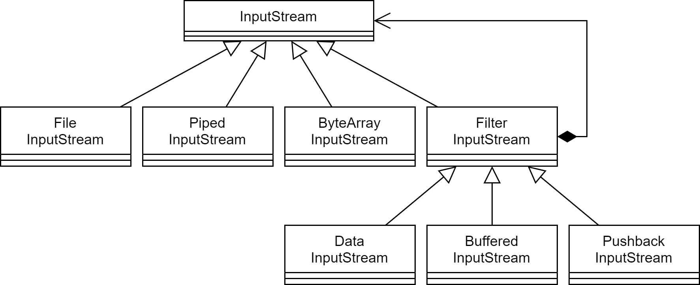
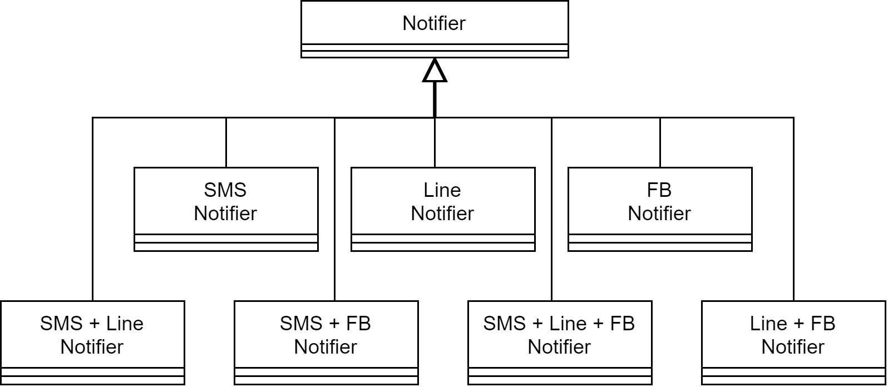
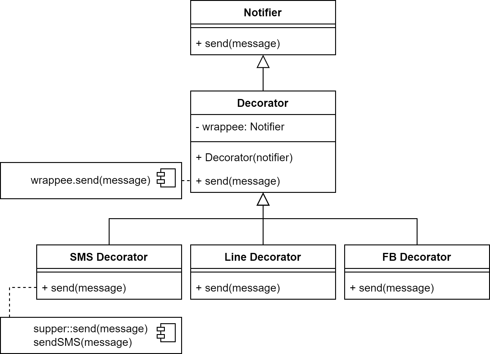

# Decorator Pattern (裝飾器模式)

> **裝飾器模式**是一種結構型設計模式，可以動態地為物件附加額外的職責。

### 裝飾器模式結構


### 裝飾器模式的應用場景

1. **如果你希望在無需修改程式碼的情況下即可使用對象，並且希望在運行時為對象增加額外的"行為"**
    > 裝飾器模式能將業務邏輯組織成層次結構，可以為各層創建一個裝飾，在運行期間將各種不同的邏輯組合成對象。這些對象都遵循通用介面，客戶端地程式碼能以相同方式使用對象。
2. **如果用繼承來擴展對象行為的方案難以實現**
    > 許多程式使用 final 限制類的進一步擴展，復用最終類已有的行為的唯一方法就是裝飾器模式：用封裝器對其進行封裝。

### 優缺點

:o:**優點**

1. 無須創建新子類即可擴展對象的行為
2. 可以在運行期間添加或刪除對象的功能
3. 可以用多個裝飾封裝對象來組合多種行為
4. 單一職責原則。可以將實現了許多不同行為的一個大類，拆分成許多較小的類

:x:**缺點**

1. 在裝飾器 stack 中刪除特定的裝飾器比較困難
2. 實現行為不受裝飾 stack 順序影響的裝飾比較困難
3. 各層的初始化配置程式碼看上去可能會很糟糕
4. 會產生很多小對象，同時也會產生很多具裝飾類，會增加系統的複雜度和學習與理解難度，有時需要工廠模式協助

## 原始的模型架構

1. 創立初期，使用抽象介面定義飲料(Beverage)，咖啡店的所有飲料都繼承他。
2. description 用來保存飲料的敘述。
3. cost()由子類別實作，用來回傳飲料的價格。


### 遇到的需求與問題

1. 因為飲料增加了調味料，如牛奶、豆漿、摩卡、奶泡。根據不同的調味品加收不同的費用，造成**類別大爆炸**。


### 錯誤方法

1. 將調味料放入飲料類別，透過 has 去判斷是否有調味料，在每一個子類的 cost()取得調味品，並計算加上調味品的價格


> [!WARNING]
>
> 違反開放/封閉原則。未來調味料越多，Beverage 和子類的 cost 就必須跟著修改。

## 開放/封閉原則

我們的目標是讓類別容易擴展，藉以納入新行為，但是不能修改既有的程式碼。實現這個目標有什麼好處？這種設計不但有因應改變的韌性，也有足夠的彈性，可以接納新功能，來滿足不斷改變的需求。

> [!IMPORTANT]
>
> 類別應該歡迎擴展，但拒絕修改
>
> Classes should be open for extension, but closed for modification.
>
> 類別應該對擴展開放，對修改封閉

### 沒有蠢問題

**Q: 該怎麼讓設計的每一個部分都遵守開放/封閉原則？**

A: 這通常不可能做到。一般來說，我們沒有那麼多資源可以把設計的每一個細節都做成這樣。遵守開放/封閉原則通常會引入新一層的抽象，讓程式更複雜。應該把注意力放在最有可能改變的地方，並且在那裡實施這些規則。

> [!NOTE]
>
> 請謹慎地選擇需要擴展的部分，**到處**採用開放/封閉原則不但浪費，也沒有必要，甚至可能寫出複雜的、難以理解的程式。

## 裝飾器概念


**Q: CondimentDecorator 繼承 Beverage 類別，這不是繼承關係嗎？**

A: 為了讓裝飾器和被他裝飾的物件有相同的型態，使用繼承*讓他們有相同的型態*，這裡的繼承*不是為了獲得行為*。

**Q: 行為是怎麼加入的？**

A: 我們不是藉著*繼承*超類別來獲得新行為，而是藉著將物件*組合*起來。因為依靠繼承，行為只能在編譯其決定，固定不變。但組合可以在執行期間，動態隨意混合搭配裝飾器。

**Q: 為什麼不把 Beverage 設計成介面？**

A: 原本就有一個抽象的 Beverage，當然可以使用介面，但通常為了避免修改既有的程式碼，所以不會在抽象類別沒有任何問題時修正他。

## 程式碼

1. 不需要修改原本的抽象飲料類別

```java
public abstract class Beverage {
    String description = "Unknown Beverage";

    public String getDescription() { // 寫好通用的方法
        return description;
    }

    public abstract double cost(); // 在子類別裡面實作
}
```

2. 為了可以和 Beverage 互換(包裝)，我們繼承 Beverage 類別

```java
public abstract class CondimentDecorator extends Beverage {
    Beverage beverage; // 我們使用Beverage超型態來引用，好讓Decorator可以包裝任何一種飲料
    public abstract String getDescription(); // 讓調味品都可以重新實作getDescription
}
```

3. 撰寫飲料基底的類別，繼承 Beverage，因為它是一種飲料

```java
public class HouseBlend extends Beverage {
    public HouseBlend() {
        description = "House Blend Coffee";
    }

    public double cost() {
        return .89; // 不需要在這個類別裡加上調味品，因此回傳原本飲料的價錢
    }
}

// -------------------------------------------

public class Espresso extends Beverage {

    public Espresso() {
        description = "Espresso";
    }

    public double cost() {
        return 1.99; // 不需要在這個類別裡加上調味品，因此回傳原本飲料的價錢
    }
}
```

4. 撰寫調味品，繼承 CondimentDecorator，用 Beverage 的參考來實例化

```java
public class Mocha extends CondimentDecorator {
    public Mocha(Beverage beverage) { // 保存被包裝的飲料(or調味品)
        this.beverage = beverage;
    }

    public String getDescription() {
        return beverage.getDescription() + ", Mocha"; // 希望description不只包含飲料，也包含被裝飾的敘述
    }

    public double cost() {
        return .20 + beverage.cost(); // 計算添加Mocha的飲料的價格，先呼叫被裝飾的物件，再將結果加上Mocha的價格。
    }
}
```

5. 最後於客戶端進行測試

```java
public class StarbuzzCoffee {

    public static void main(String args[]) {
        Beverage beverage = new Espresso();
        System.out.println(beverage.getDescription() + " $" + beverage.cost()); // 不添加調味料

        Beverage beverage2 = new DarkRoast();
        beverage2 = new Mocha(beverage2); // 可以動態決定要加多少個，多少種類都行
        beverage2 = new Mocha(beverage2);
        beverage2 = new Whip(beverage2);
        System.out.println(beverage2.getDescription() + " $" + beverage2.cost()); // 添加調味料
    }
}
```

### 沒有蠢問題

**Q: 如果測試某個具體組件來做某件事情的程式，如：HouseBlend 來進行打折，當 HouseBlend 包在裝飾器裡面之後，那種程式就失效了**

A: 當程式*依賴具體組件型態*時，裝飾器會破壞那段程式碼，但只要針對*抽象組件型態寫程式*，那麼裝飾器對程式碼來說仍然透明。然而，一旦針對*具體的組件寫程式*，就要重新思考應用程式的設計，以及裝飾器的使用了。

**Q: 用戶端會不會很容易漏掉其中一個裝飾器？如：一杯 Mocha、Soy 與 Whip 的 DarkRoast，會不會訂單漏了 Whip**

A: 沒錯，使用裝飾器模式，必須管理更多物件，所以更容易寫錯。但是，通常會用其他模式來製作裝飾器，例如*工廠模式*和*建造者模式*，可以看到用建立具體組件和他的裝飾器的做法是妥善封裝的。

**Q: 如果想讓 getDescription()印出「Whip, Double Mocha」而不是「Mocha, Whip, Mocha」**

A: 裝飾器的目的是幫裡面的物品加上行為，一旦你企圖窺視一組裝飾器裡面的每一個裝飾器時，就違背他們的初衷了。可以用一個 CondimentPrettyPrint 裝飾器(另外建一個裝飾器解決)來解析最終的 decription，或回傳 ArrayList。

## 更多實際上的例子

1. java.io 中的 InputStream、FilterInputStream、BufferedInputStream、ZipInputStream



2. Servlet 中的 ServletRequestWrapper、ServletResponseWrapper、HttpServletRequestWrapper、HttpServletResponseWrapper

3. spring 的 ApplicationContext 中，配置所有的 DataSource，可能是各種不同的類型，如:Oracle、SQL Server、MySQL，然後 SessionFactory 根據客戶每一次的請求，將 DataSource 設置成不同的數據源。

    > Spring 中用到裝飾器模式會在類別名上有兩種表現：一種是類別名中含有 Wrapper(SessionRepositoryRequestWrapper)、另一種是類別名中含有 Decorator(TransactionAwareCacheDecorator )。基本上都是動態地給一個對象添加一些額外的職責。

4. notify 中有多個通知要發送，如果都為每一種發送管道增加一個 class 會造成爆炸，可以在發送基礎上增加職責




